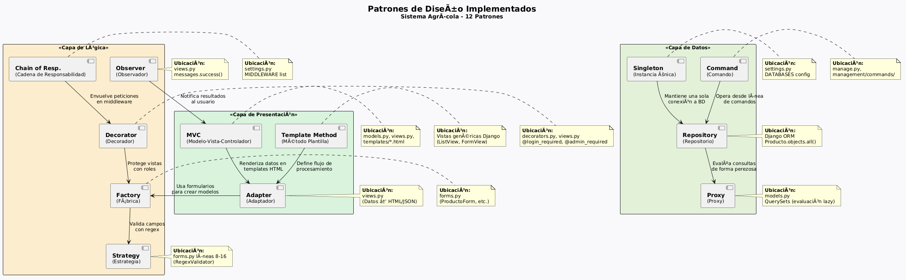

# Patrones de Diseño en el Sistema Agrícola

> Documentación de 12 patrones de diseño implementados en el Sistema Agrícola.

---

## Diagrama General de Patrones



*Diagrama que muestra los 12 patrones organizados por capas (Presentación, Lógica, Datos) y sus relaciones.*

---

## 1. Modelo-Vista-Controlador (MVC)

**Tipo:** Arquitectónico  
**Ubicación:** Todo el proyecto

El sistema sigue el patrón MVC de Django separando claramente:
- **Modelos** (`models.py`): Estructura de datos (Producto, Categoria, Compra, Venta)
- **Vistas** (`views.py`): Lógica de negocio y orquestación
- **Plantillas** (`templates/`): Presentación al usuario

```python
# models.py - Modelo (Datos)
class Producto(models.Model):
    nombre = models.CharField(max_length=200)
    precio = models.DecimalField(max_digits=10, decimal_places=2)

# views.py - Vista (Lógica)
def producto_list(request):
    productos = Producto.objects.all()
    return render(request, 'agricola/producto_list.html', {'productos': productos})

<!-- producto_list.html - Vista (Presentación) -->
<h1>{{ producto.nombre }}</h1>
<p>${{ producto.precio }}</p>
```

---

## 2. Singleton

**Tipo:** Creacional  
**Ubicación:** Django ORM (`settings.py`)

La conexión a la base de datos se gestiona como singleton. Django garantiza una única instancia del engine de BD durante todo el ciclo de vida de la aplicación.

```python
# settings.py - Configuración única de BD
DATABASES = {
    'default': {
        'ENGINE': 'django.db.backends.sqlite3',
        'NAME': BASE_DIR / 'db.sqlite3',
    }
}
```

---

## 3. Factory (Fábrica)

**Tipo:** Creacional  
**Ubicación:** `agricola/forms.py`

Los formularios de Django actúan como fábricas que crean y validan instancias de modelos. `ProductoForm` encapsula la creación de objetos Producto con validaciones específicas.

```python
class ProductoForm(forms.ModelForm):
    nombre = forms.CharField(max_length=200, validators=[nombre_validator])
    
    class Meta:
        model = Producto
        fields = ['nombre', 'descripcion', 'precio', 'stock', 'categoria']

# Uso en la vista - la fábrica crea el objeto validado
form = ProductoForm(request.POST)
if form.is_valid():
    producto = form.save()  # Factory crea la instancia
```

---

## 4. Observer (Observador)

**Tipo:** Comportamiento  
**Ubicación:** `django.contrib.messages`

El sistema de mensajes implementa el patrón observador. Cuando ocurre una operación (crear, editar, eliminar), se emite un mensaje que es observado y mostrado al usuario.

```python
# Emisión del evento
messages.success(request, 'Producto creado exitosamente.')

# Captura en template

    <div class="alert alert-{{ message.tags }}">{{ message }}</div>

```

---

## 5. Adapter (Adaptador)

**Tipo:** Estructural  
**Ubicación:** `agricola/views.py`

Las vistas adaptan los datos del modelo a formatos específicos para la web. Por ejemplo, `producto_list` adapta objetos Producto a un contexto HTML, y las vistas AJAX devuelven HTML parcial o JSON según el encabezado de la solicitud.

```python
def producto_list(request):
    productos = Producto.objects.all()
    if request.headers.get('x-requested-with') == 'XMLHttpRequest':
        return render(request, 'agricola/producto_list_content.html', {'productos': productos})
    return render(request, 'agricola/producto_list.html', {'productos': productos})
```

---

## 6. Strategy (Estrategia)

**Tipo:** Comportamiento  
**Ubicación:** `agricola/forms.py` (validators)

Múltiples estrategias de validación intercambiables según el tipo de campo.

```python
nombre_validator = RegexValidator(
    regex=r'^[A-Za-zÁÉÍÓÚáéíóúÑñ\s]{3,}$',
    message='El nombre debe tener al menos 3 caracteres.'
)

precio_validator = RegexValidator(
    regex=r'^\d+(\.\d{1,2})?$',
    message='Precio válido con hasta 2 decimales.'
)

# Aplicación de diferentes estrategias según el campo
class ProductoForm(forms.ModelForm):
    nombre = forms.CharField(validators=[nombre_validator])
    precio = forms.DecimalField(validators=[precio_validator])
```

---

## 7. Proxy

**Tipo:** Estructural  
**Ubicación:** Django QuerySets

Los QuerySets de Django son proxies que permiten evaluación perezosa (lazy loading). Las consultas se construyen encadenando métodos pero solo se ejecutan cuando se accede a los datos.

```python
# La consulta no se ejecuta aquí (Proxy)
qs = Producto.objects.filter(precio__gt=10).order_by('-created_at')

# La consulta se ejecuta aquí (acceso a datos)
for producto in qs:
    print(producto.nombre)
```

---

## 8. Decorator (Decorador)

**Tipo:** Estructural  
**Ubicación:** `agricola/decorators.py`, `django.contrib.auth.decorators`

Los decoradores añaden funcionalidad transversal (autenticación, autorización) sin modificar la lógica interna de las vistas.

```python
# Decoradores personalizados
def admin_required(view_func):
    @user_passes_test(lambda u: u.is_superuser or u.groups.filter(name='Admin').exists())
    def wrapper(request, *args, **kwargs):
        return view_func(request, *args, **kwargs)
    return wrapper

# Uso
@admin_required
def categoria_delete(request, pk):
    # Solo admins pueden eliminar categorías
    ...
```

---

## 9. Repository (Repositorio)

**Tipo:** Persistencia  
**Ubicación:** Django ORM (`models.py`)

Django ORM actúa como una capa de repositorio que abstrae el almacenamiento y recuperación de datos, permitiendo cambiar el motor de BD sin afectar la lógica de negocio.

```python
# El repositorio ORM abstrae la persistencia
Producto.objects.create(nombre='Tomate', precio=2.50)
productos = Producto.objects.filter(categoria__nombre='Verduras')
producto = Producto.objects.get(pk=1)
producto.delete()
```

---

## 10. Chain of Responsibility (Cadena de Responsabilidad)

**Tipo:** Comportamiento  
**Ubicación:** Django Middleware (`settings.py`)

Cada middleware en la cadena procesa la solicitud y decide si pasarla al siguiente o devolver una respuesta.

```python
MIDDLEWARE = [
    'django.middleware.security.SecurityMiddleware',
    'django.contrib.sessions.middleware.SessionMiddleware',
    'django.middleware.csrf.CsrfViewMiddleware',
    'django.contrib.auth.middleware.AuthenticationMiddleware',
    'django.contrib.messages.middleware.MessageMiddleware',
    'django.middleware.clickjacking.XFrameOptionsMiddleware',
]
```

---

## 11. Template Method (Método Plantilla)

**Tipo:** Comportamiento  
**Ubicación:** Vistas genéricas de Django

Las vistas basadas en clase de Django implementan el patrón Template Method, donde el método `dispatch()` define el esqueleto del proceso y los métodos hook (`get()`, `post()`, `get_queryset()`) permiten personalizar pasos específicos.

```python
# Las vistas basadas en clase siguen Template Method
# dispatch() llama a get() o post() según el método HTTP
# Similar a:
from django.views.generic import ListView

class ProductoListView(ListView):
    model = Producto
    template_name = 'agricola/producto_list.html'
    
    def get_queryset(self):
        # Hook para personalizar la consulta
        return Producto.objects.filter(stock__gt=0)
```

---

## 12. Command (Comando)

**Tipo:** Comportamiento  
**Ubicación:** `manage.py`, management commands

Django implementa el patrón Command para operaciones desde línea de comandos. Cada comando encapsula una operación específica.

```bash
# Ejemplos de comandos
python manage.py migrate      # Ejecuta migraciones
python manage.py createsuperuser  # Crea superusuario
python manage.py runserver    # Inicia servidor
python manage.py test agricola # Ejecuta pruebas
```

--- 

## Beneficios de los Patrones

| Beneficio | Descripción |
|-----------|-------------|
| **Mantenibilidad** | Código organizado y desacoplado |
| **Extensibilidad** | Nuevas funcionalidades sin afectar existentes |
| **Reutilización** | Componentes reutilizables en todo el sistema |
| **Claridad** | Código legible y familiar para desarrolladores Django |
| **Seguridad** | Separación de capas permite integrar seguridad sin contaminar lógica |
| **Testeabilidad** | Componentes independientes facilitan pruebas unitarias |
