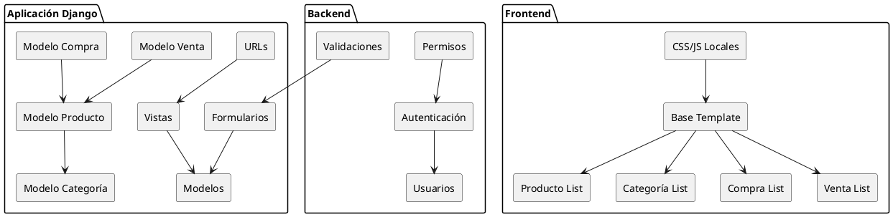

# Sistema Agrícola - Plataforma de Compra y Venta de Productos Agrícolas

## Descripción
Este sistema permite gestionar productos agrícolas, categorías, compras y ventas en una plataforma web desarrollada con Django. Incluye funcionalidades de autenticación por roles, validaciones de entrada, seguridad y una interfaz de usuario moderna con características de Single Page Application (SPA).

## Características Principales
- Gestión completa de productos agrícolas (CRUD)
- Gestión de categorías de productos
- Registro de compras y ventas
- Autenticación y autorización por roles
- Validaciones de entrada con expresiones regulares
- Seguridad XSS y CSRF
- Interfaz SPA (Single Page Application)
- Alertas visuales para retroalimentación al usuario
- Recursos locales (no depende de CDNs)
- Diseño responsivo con Bootstrap

## Arquitectura del Sistema



## Instalación

### Requisitos Previos
- Python 3.8 o superior
- Django 4.0 o superior
- pip (gestor de paquetes de Python)

### Pasos de Instalación

1. Clonar el repositorio:
```bash
git clone <url-del-repositorio>
cd lilliana2
```

2. Crear un entorno virtual:
```bash
python -m venv venv
```

3. Activar el entorno virtual:
```bash
# En Windows
venv\Scripts\activate

# En macOS/Linux
source venv/bin/activate
```

4. Instalar las dependencias:
```bash
pip install django
```

5. Realizar migraciones:
```bash
python manage.py makemigrations
python manage.py migrate
```

6. Crear un superusuario:
```bash
python manage.py createsuperuser
```

7. Ejecutar el servidor de desarrollo:
```bash
python manage.py runserver
```

## Patrones de Diseño Implementados

1. **Singleton**: La conexión a la base de datos se gestiona como un singleton a través de Django ORM.

2. **Factory**: Los formularios de Django utilizan patrones de fábrica para crear instancias de modelos con validaciones específicas.

3. **Observer**: El sistema de mensajes de Django implementa el patrón observer para notificar eventos al usuario.

4. **MVC (Model-View-Controller)**: La arquitectura general sigue el patrón MVC de Django, separando modelos, vistas y plantillas.

## Validaciones Implementadas

- Nombre de producto/categoría: Al menos 3 caracteres, solo letras y espacios
- Precio: Números positivos con hasta 2 decimales
- Stock: Números enteros no negativos
- Expresiones regulares para todas las validaciones

## Seguridad

- Protección CSRF en todos los formularios
- Filtrado XSS en las plantillas
- Validación de entrada en formularios
- Control de acceso basado en roles
- Sanitización de entradas de usuario

## Estructura del Proyecto

```
lilliana2/
│
├── manage.py
├── db.sqlite3
├── README.md
├── lilliana/
│   ├── __init__.py
│   ├── settings.py
│   ├── urls.py
│   └── wsgi.py
└── agricola/
    ├── __init__.py
    ├── models.py
    ├── views.py
    ├── forms.py
    ├── urls.py
    ├── migrations/
    └── templates/
        └── agricola/
            ├── base.html
            ├── producto_list.html
            ├── producto_form.html
            ├── producto_confirm_delete.html
            ├── categoria_list.html
            ├── categoria_form.html
            ├── categoria_confirm_delete.html
            ├── compra_list.html
            ├── compra_form.html
            ├── venta_list.html
            └── venta_form.html
```

## Uso

1. Accede a http://localhost:8000/agricola/productos/ para ver la lista de productos
2. Para acceder al panel de administración, ve a http://localhost:8000/admin/
3. Para crear nuevos productos, categorías, compras o ventas, utiliza los enlaces correspondientes en el menú

## Contribución
1. Haz fork del repositorio.
2. Crea una rama nueva: `git checkout -b feature/xxx`.
3. Haz tus cambios.
4. Commit: `git commit -m 'Añadir función xxx'`.
5. Push: `git push origin feature/xxx`.
6. Abre un Pull Request.