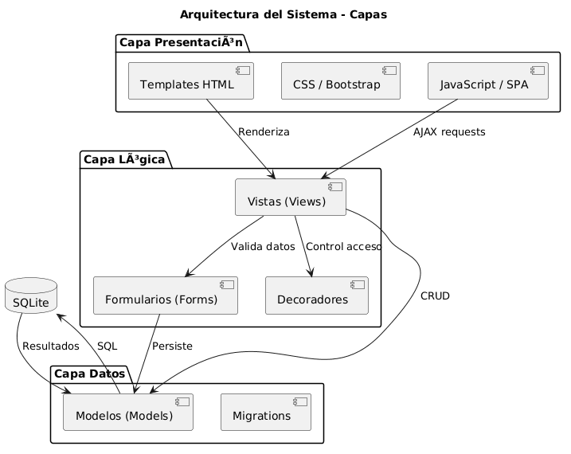
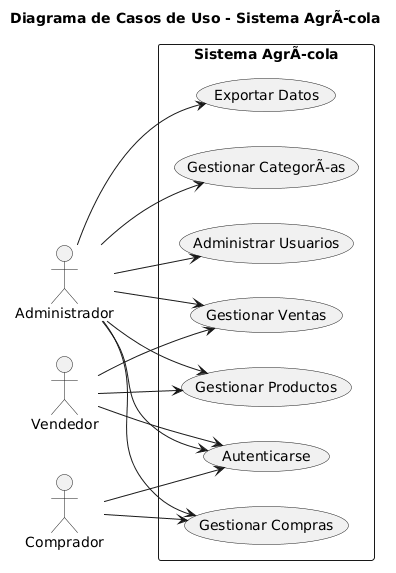
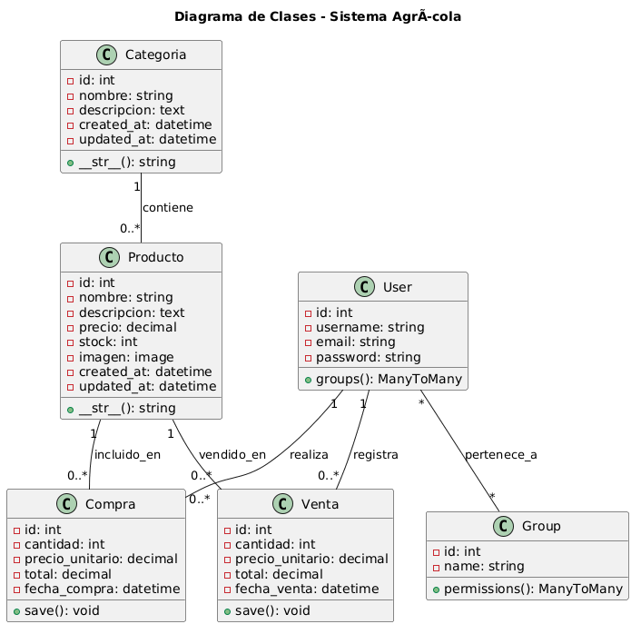
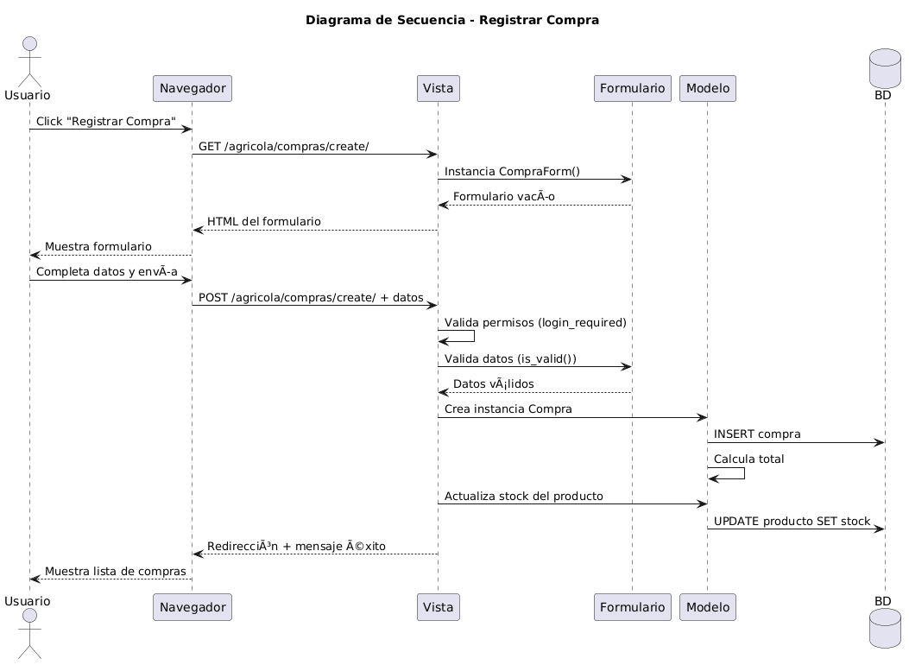
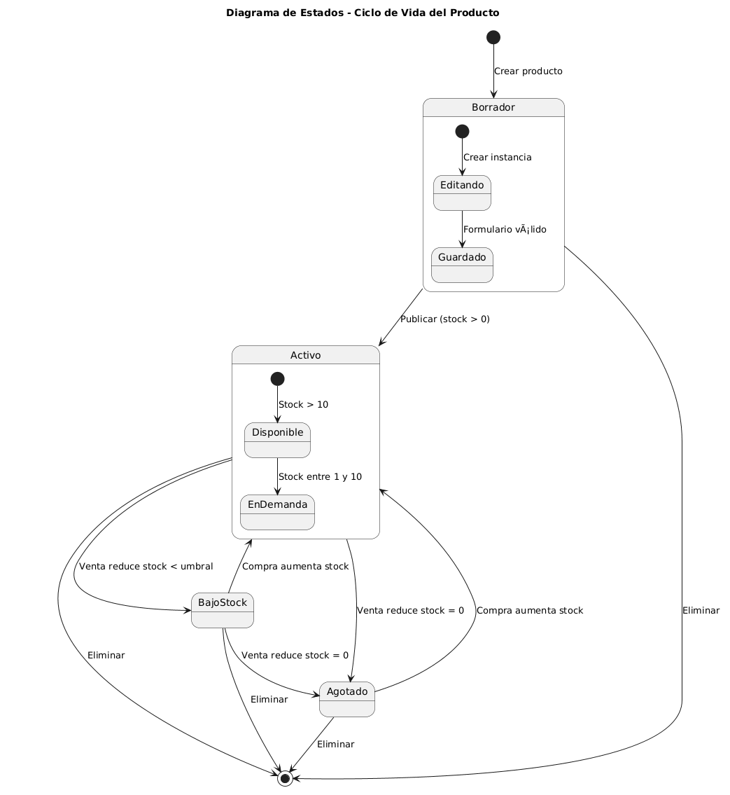

# Sistema Agrícola 🌱

> Plataforma de Compra y Venta de Productos Agrícolas


---

## 📋 Descripción

Sistema web desarrollado en Django para la gestión integral de productos agrícolas. Permite administrar categorías, productos, compras y ventas con autenticación por roles, interfaz SPA, seguridad multicapa y diseño responsivo con temática agrícola.

---

## ✨ Características Principales

| Funcionalidad | Estado | Detalle |
|--------------|--------|---------|
| **Login con roles** | ✅ | 3 roles: Admin, Vendedor, Comprador |
| **CRUD completo** | ✅ | Productos, Categorías, Compras, Ventas |
| **Menú SPA** | ✅ | Navegación sin recarga con pushState |
| **Alertas visuales** | ✅ | Sistema de mensajes con auto-ocultación |
| **Bootstrap local** | ✅ | Sin dependencias CDN |
| **Validaciones regex** | ✅ | Nombre, precio, usuario, contraseña |
| **4 capas seguridad** | ✅ | Autenticación, Autorización, Protección, Validación |
| **Diseño responsivo** | ✅ | Tema agrícola con Bootstrap 5.3 |
| **Stock automático** | ✅ | Actualización en compras y ventas |
| **Exportación CSV** | ✅ | Categorías exportables |

---

## 🏗️ Arquitectura del Sistema



### Capas de la Aplicación

| Capa | Tecnología | Función |
|------|-----------|---------|
| **Presentación** | HTML + Bootstrap 5.3 + jQuery | Templates con AJAX SPA |
| **Lógica** | Django Views + Forms + Decorators | Procesamiento y validación |
| **Datos** | Django Models + SQLite | Persistencia y consultas |
| **Seguridad** | 4 capas (autenticación, autorización, protección, validación) | Control de acceso y sanitización |

---

## 🗺️ Diagramas UML

### Diagrama de Casos de Uso


### Diagrama de Clases


### Diagrama de Secuencia (Registro de Compra)


### Diagrama de Estados (Ciclo de Vida del Producto)


---

## 🎨 Patrones de Diseño (12 Implementados)

Ver documentación completa en [`PATTERNS.md`](PATTERNS.md).

| # | Patrón | Ubicación | Propósito |
|---|--------|-----------|-----------|
| 1 | **MVC** | Todo el proyecto | Separación de responsabilidades |
| 2 | **Singleton** | Django ORM | Conexión única a BD |
| 3 | **Factory** | `forms.py` | Creación de modelos con validación |
| 4 | **Observer** | `messages` framework | Notificaciones al usuario |
| 5 | **Adapter** | `views.py` | Adaptación lógica → web |
| 6 | **Strategy** | `validators` | Validación intercambiable |
| 7 | **Proxy** | QuerySets | Evaluación perezosa |
| 8 | **Decorator** | `@login_required`, `@admin_required` | Extensión de funciones |
| 9 | **Repository** | Django ORM | Abstracción de persistencia |
| 10 | **Chain of Resp.** | Middleware | Procesamiento en cadena |
| 11 | **Template Method** | Class-based views | Esqueleto de proceso |
| 12 | **Command** | `manage.py` | Operaciones desde CLI |

---

## 🔒 Seguridad - 4 Capas

### Capa 1: Autenticación
- Login con Django Auth
- Registro de usuarios con validación
- Decorador `@login_required`
- Sesiones con cookies HTTP-only

### Capa 2: Autorización
- 3 roles: `Admin`, `Vendedor`, `Comprador`
- Decoradores: `@admin_required`, `@vendedor_required`, `@comprador_required`
- Admin: CRUD completo + exportación
- Vendedor: Productos + Ventas
- Comprador: Solo compras

### Capa 3: Protección de Datos
- CSRF tokens en todos los formularios
- `X-Frame-Options: DENY`
- `SECURE_CONTENT_TYPE_NOSNIFF`
- `SECURE_BROWSER_XSS_FILTER`
- Cookies HTTP-only para sesión y CSRF
- Variables de entorno con `python-dotenv`

### Capa 4: Validación y Sanitización
- Regex en nombre (`^[A-Za-zÁÉÍÓÚáéíóúÑñ\s]{3,}$`)
- Regex en precio (`^\d+(\.\d{1,2})?$`)
- Regex en usuario (`^[a-zA-Z0-9_]{4,}$`)
- Regex en contraseña (`^(?=.*[A-Z])(?=.*\d).{8,}$`)
- Escape de HTML en entradas
- Validación de stock negativo
- Verificación stock suficiente en ventas

---

## 🚀 Instalación

### Requisitos
- Python 3.8+
- Django 6.0+
- pip

### Pasos

```bash
# 1. Clonar
git clone <url-del-repositorio>
cd lilliana2

# 2. Entorno virtual
python -m venv venv
source venv/bin/activate  # Linux/Mac
# venv\Scripts\activate   # Windows

# 3. Dependencias
pip install django python-dotenv

# 4. Configurar variables de entorno
cp .env.example .env
# Editar SECRET_KEY y DEBUG según necesidad

# 5. Migraciones
python manage.py makemigrations
python manage.py migrate

# 6. Crear grupos de roles
python manage.py shell -c "
from django.contrib.auth.models import Group
Group.objects.get_or_create(name='Admin')
Group.objects.get_or_create(name='Vendedor')
Group.objects.get_or_create(name='Comprador')
print('Roles creados exitosamente')
"

# 7. Superusuario
python manage.py createsuperuser

# 8. Ejecutar
python manage.py runserver
```

---

## 📁 Estructura del Proyecto

```
lilliana2/
├── manage.py
├── .env                    # Variables de entorno
├── .gitignore
├── README.md
├── PATTERNS.md
├── START.md
├── docs/
│   └── diagrams/           # Diagramas UML renderizados
├── lilliana/               # Config del proyecto
│   ├── settings.py
│   ├── urls.py
│   └── wsgi.py
├── agricola/              # App principal
│   ├── models.py          # Producto, Categoria, Compra, Venta
│   ├── views.py           # Vistas CRUD + SPA
│   ├── forms.py           # Formularios con validación regex
│   ├── decorators.py      # Roles: admin, vendedor, comprador
│   ├── admin.py           # Modelos registrados en admin
│   └── templates/agricola/
├── templates/registration/ # Login + Registro
└── static/                 # CSS, JS, fuentes (local, sin CDN)
    ├── css/
    │   ├── bootstrap.min.css
    │   ├── bootstrap-icons.min.css
    │   └── custom.css      # Tema agrícola personalizado
    ├── js/
    │   ├── jquery.min.js
    │   ├── bootstrap.bundle.min.js
    │   └── main.js         # SPA con pushState
    └── fonts/
```

---

## 📊 Rutas del Sistema

| Ruta | Método | Acceso | Descripción |
|------|--------|--------|-------------|
| `/` | GET | Público | Redirección a productos |
| `/login/` | GET/POST | Público | Inicio de sesión |
| `/registro/` | GET/POST | Público | Registro de usuarios |
| `/logout/` | GET | Autenticado | Cerrar sesión |
| `/admin/` | GET | Superuser | Panel de administración |
| `/agricola/productos/` | GET | Autenticado | Listar productos |
| `/agricola/productos/create/` | GET/POST | Vendedor+ | Crear producto |
| `/agricola/productos/<id>/edit/` | GET/POST | Vendedor+ | Editar producto |
| `/agricola/productos/<id>/delete/` | GET/POST | Admin | Eliminar producto |
| `/agricola/categorias/` | GET | Autenticado | Listar categorías |
| `/agricola/categorias/create/` | GET/POST | Admin | Crear categoría |
| `/agricola/categorias/<id>/edit/` | GET/POST | Admin | Editar categoría |
| `/agricola/categorias/<id>/delete/` | GET/POST | Admin | Eliminar categoría |
| `/agricola/categorias/exportar/` | GET | Admin | Exportar CSV |
| `/agricola/compras/` | GET | Autenticado | Listar compras |
| `/agricola/compras/create/` | GET/POST | Comprador+ | Registrar compra |
| `/agricola/ventas/` | GET | Autenticado | Listar ventas |
| `/agricola/ventas/create/` | GET/POST | Vendedor+ | Registrar venta |

---

## 🧪 Pruebas

```bash
python manage.py test agricola
```

---

## 📄 Licencia

Este proyecto es desarrollado con fines educativos.
